# 🛒 FLUJO DE VENTA ONLINE - DELICIAS JURÁSICAS

## 📋 Diagrama de Flujo Completo

```mermaid
flowchart TD
    A[Cliente navega catálogo] --> B[Agrega productos al carrito]
    B --> C[Cliente hace checkout]
    C --> D[Se crea Order PENDING]
    D --> E[Cliente paga]
    E --> F{Pago exitoso?}
    
    F -->|NO| G[Order CANCELLED]
    F -->|SÍ| H[Order PAID]
    
    H --> I{Producto en stock?}
    
    I -->|SÍ| J[Descontar stock directamente]
    I -->|NO| K[Crear Production Order]
    
    K --> L[Panadero inicia producción]
    L --> M[Descontar insumos según receta]
    M --> N[Incrementar stock producto terminado]
    N --> J
    
    J --> O[Order IN_PRODUCTION]
    O --> P[Order READY]
    P --> Q{Tipo de entrega?}
    
    Q -->|ENTREGA| R[Asignar Repartidor]
    Q -->|RETIRO| S[Cliente retira]
    
    R --> T[Order IN_TRANSIT]
    T --> U[Order DELIVERED]
    S --> U
    
    U --> V[Order COMPLETED]
    V --> W[Registrar movimiento de stock]
    W --> X[Actualizar reportes]
```



---

## 🔄 Paso a Paso Detallado

### **FASE 1: Navegación y Carrito (Cliente)**

#### 1.1 Cliente agrega productos al carrito

**Endpoint**: `POST /cart/items`

```json
{
  "productId": "uuid-pastel-trex",
  "quantity": 2
}
```

**Lógica en CartService**:
```typescript
async addItem(userId: string, productId: string, quantity: number) {
  // Obtener o crear carrito
  let cart = await this.prisma.cart.findFirst({
    where: { userId, expiresAt: { gte: new Date() } }
  });
  
  if (!cart) {
    cart = await this.prisma.cart.create({
      data: { 
        userId,
        expiresAt: new Date(Date.now() + 7 * 24 * 60 * 60 * 1000) // 7 días
      }
    });
  }
  
  // Verificar stock disponible
  const product = await this.prisma.product.findUnique({
    where: { id: productId }
  });
  
  if (product.currentStock < quantity) {
    throw new BadRequestException('Stock insuficiente');
  }
  
  // Agregar o actualizar item
  return this.prisma.cartItem.upsert({
    where: { 
      cartId_productId: { cartId: cart.id, productId }
    },
    create: { cartId: cart.id, productId, quantity },
    update: { quantity: { increment: quantity } }
  });
}
```

#### 1.2 Cliente selecciona dirección de entrega

**Endpoint**: `GET /addresses`

El cliente selecciona una dirección existente o crea una nueva.

---

### **FASE 2: Checkout y Creación de Orden**

#### 2.1 Convertir carrito en orden

**Endpoint**: `POST /cart/checkout`

```json
{
  "deliveryAddressId": "uuid-direccion",
  "promotionCode": "TREX2X1",
  "paymentMethod": "CARD"
}
```

**Lógica en OrdersService**:
```typescript
async createFromCart(userId: string, checkoutData: CheckoutDto) {
  const cart = await this.prisma.cart.findFirst({
    where: { userId },
    include: { 
      items: { include: { product: true } },
      user: true
    }
  });
  
  if (!cart || cart.items.length === 0) {
    throw new BadRequestException('Carrito vacío');
  }
  
  // Calcular subtotal
  const subtotal = cart.items.reduce((sum, item) => 
    sum + (item.product.salePrice * item.quantity), 0
  );
  
  // Validar y aplicar promoción
  let discountAmount = 0;
  let promotionId = null;
  
  if (checkoutData.promotionCode) {
    const { discount, promotion } = await this.promotionsService.validatePromotion(
      checkoutData.promotionCode,
      subtotal
    );
    discountAmount = discount;
    promotionId = promotion.id;
  }
  
  // Calcular costos de envío
  const shippingCost = await this.calculateShipping(checkoutData.deliveryAddressId, subtotal);
  
  // Calcular impuestos (IVA 16%)
  const taxRate = await this.settingsService.get('tax_rate', 16);
  const taxAmount = (subtotal - discountAmount) * (taxRate / 100);
  
  // Total final
  const total = subtotal - discountAmount + shippingCost + taxAmount;
  
  // Crear orden en transacción
  return this.prisma.$transaction(async (tx) => {
    const order = await tx.order.create({
      data: {
        type: 'ONLINE',
        status: 'PENDING',
        customerId: userId,
        customerName: `${cart.user.firstName} ${cart.user.lastName}`,
        customerEmail: cart.user.email,
        customerPhone: cart.user.phone,
        deliveryAddressId: checkoutData.deliveryAddressId,
        subtotal,
        discountAmount,
        shippingCost,
        taxAmount,
        total,
        promotionId,
        paymentMethod: checkoutData.paymentMethod,
        paymentStatus: 'PENDING',
        items: {
          create: cart.items.map(item => ({
            productId: item.productId,
            quantity: item.quantity,
            unitPrice: item.product.salePrice,
            unitCost: item.product.costPrice,
            subtotal: item.product.salePrice * item.quantity,
            total: item.product.salePrice * item.quantity
          }))
        }
      },
      include: { items: true }
    });
    
    // Limpiar carrito
    await tx.cartItem.deleteMany({ where: { cartId: cart.id } });
    
    // Incrementar uso de promoción
    if (promotionId) {
      await tx.promotion.update({
        where: { id: promotionId },
        data: { usageCount: { increment: 1 } }
      });
    }
    
    return order;
  });
}
```

---

### **FASE 3: Procesamiento de Pago**

#### 3.1 Cliente realiza el pago

**Endpoint**: `POST /orders/:id/pay`

**Integraciones posibles**:
- Stripe
- PayPal
- MercadoPago
- Conekta (México)

```typescript
async processPayment(orderId: string, paymentData: PaymentDto) {
  const order = await this.prisma.order.findUnique({
    where: { id: orderId }
  });
  
  // Integrar con gateway de pago
  const paymentResult = await this.paymentGateway.charge({
    amount: order.total,
    currency: 'MXN',
    token: paymentData.token
  });
  
  if (paymentResult.success) {
    // Actualizar orden
    const updatedOrder = await this.prisma.order.update({
      where: { id: orderId },
      data: {
        status: 'PAID',
        paymentStatus: 'COMPLETED',
        paidAt: new Date()
      },
      include: { items: { include: { product: true } } }
    });
    
    // Enviar email de confirmación
    await this.notificationsService.sendOrderConfirmation(updatedOrder);
    
    // Iniciar procesamiento de inventario
    await this.processInventory(updatedOrder);
    
    return updatedOrder;
  } else {
    throw new BadRequestException('Pago rechazado');
  }
}
```

---

### **FASE 4: Gestión de Inventario (CRÍTICO)**

#### 4.1 Verificar disponibilidad de stock

```typescript
async processInventory(order: Order) {
  for (const item of order.items) {
    const product = item.product;
    
    // ¿Hay stock suficiente?
    if (product.currentStock >= item.quantity) {
      // CASO A: Stock disponible → Descontar directamente
      await this.inventoryService.decrementStock(
        product.id,
        item.quantity,
        order.id
      );
    } else {
      // CASO B: Sin stock → Crear orden de producción
      await this.createProductionOrderForItem(item);
    }
  }
  
  // Actualizar estado de la orden
  await this.updateOrderStatus(order.id, 'IN_PRODUCTION');
}
```

#### 4.2 CASO A: Descontar stock existente

```typescript
async decrementStock(productId: string, quantity: number, orderId: string) {
  const product = await this.prisma.product.findUnique({
    where: { id: productId }
  });
  
  const previousStock = product.currentStock;
  const newStock = previousStock - quantity;
  
  return this.prisma.$transaction([
    // Actualizar stock del producto
    this.prisma.product.update({
      where: { id: productId },
      data: { currentStock: newStock }
    }),
    
    // Registrar movimiento
    this.prisma.stockMovement.create({
      data: {
        productId,
        type: 'VENTA',
        quantity: -quantity,
        previousStock,
        newStock,
        orderId
      }
    })
  ]);
}
```

#### 4.3 CASO B: Crear orden de producción

```typescript
async createProductionOrderForItem(orderItem: OrderItem) {
  const product = await this.prisma.product.findUnique({
    where: { id: orderItem.productId },
    include: { recipe: { include: { ingredients: true } } }
  });
  
  if (!product.recipe) {
    throw new BadRequestException(
      `El producto ${product.name} no tiene receta definida`
    );
  }
  
  // Verificar disponibilidad de insumos
  for (const ingredient of product.recipe.ingredients) {
    const requiredQty = ingredient.quantity * orderItem.quantity;
    const insumo = await this.prisma.product.findUnique({
      where: { id: ingredient.ingredientId }
    });
    
    if (insumo.currentStock < requiredQty) {
      throw new BadRequestException(
        `Insuficiente stock de ${insumo.name}. ` +
        `Necesario: ${requiredQty} ${insumo.measureUnit}, ` +
        `Disponible: ${insumo.currentStock}`
      );
    }
  }
  
  // Crear orden de producción
  const productionOrder = await this.prisma.productionOrder.create({
    data: {
      productId: orderItem.productId,
      quantity: orderItem.quantity,
      status: 'PENDIENTE',
      scheduledDate: new Date()
    }
  });
  
  // Notificar al panadero
  await this.notificationsService.notifyBaker(productionOrder);
  
  return productionOrder;
}
```

---

### **FASE 5: Producción (Panadero)**

#### 5.1 Panadero inicia la producción

**Endpoint**: `PATCH /production/orders/:id/start`

```typescript
async startProduction(orderId: string, userId: string) {
  return this.prisma.productionOrder.update({
    where: { id: orderId },
    data: {
      status: 'EN_PROCESO',
      assignedToId: userId,
      startedAt: new Date()
    }
  });
}
```

#### 5.2 Panadero completa la producción

**Endpoint**: `PATCH /production/orders/:id/complete`

**Esta es la lógica MÁS CRÍTICA del sistema**:

```typescript
async completeProductionOrder(orderId: string) {
  const order = await this.prisma.productionOrder.findUnique({
    where: { id: orderId },
    include: {
      product: {
        include: {
          recipe: {
            include: {
              ingredients: {
                include: { ingredient: true }
              }
            }
          }
        }
      }
    }
  });
  
  if (!order.product.recipe) {
    throw new BadRequestException('Producto sin receta');
  }
  
  // TRANSACCIÓN ATÓMICA
  return this.prisma.$transaction(async (tx) => {
    const movements = [];
    
    // 1. DESCONTAR INSUMOS
    for (const recipeIngredient of order.product.recipe.ingredients) {
      const ingredient = recipeIngredient.ingredient;
      const quantityNeeded = recipeIngredient.quantity * order.quantity;
      
      const previousStock = ingredient.currentStock;
      const newStock = previousStock - quantityNeeded;
      
      if (newStock < 0) {
        throw new BadRequestException(
          `Stock negativo para ${ingredient.name}`
        );
      }
      
      // Actualizar stock del insumo
      await tx.product.update({
        where: { id: ingredient.id },
        data: { currentStock: newStock }
      });
      
      // Registrar movimiento de salida
      const movement = await tx.stockMovement.create({
        data: {
          productId: ingredient.id,
          type: 'PRODUCCION_SALIDA',
          quantity: -quantityNeeded,
          previousStock,
          newStock,
          productionOrderId: orderId,
          costPerUnit: ingredient.costPrice
        }
      });
      
      movements.push(movement);
    }
    
    // 2. INCREMENTAR PRODUCTO TERMINADO
    const productPreviousStock = order.product.currentStock;
    const productNewStock = productPreviousStock + order.quantity;
    
    await tx.product.update({
      where: { id: order.productId },
      data: { currentStock: productNewStock }
    });
    
    // Registrar movimiento de entrada
    await tx.stockMovement.create({
      data: {
        productId: order.productId,
        type: 'PRODUCCION_ENTRADA',
        quantity: order.quantity,
        previousStock: productPreviousStock,
        newStock: productNewStock,
        productionOrderId: orderId
      }
    });
    
    // 3. ACTUALIZAR ORDEN DE PRODUCCIÓN
    const completedOrder = await tx.productionOrder.update({
      where: { id: orderId },
      data: {
        status: 'COMPLETADO',
        completedAt: new Date()
      }
    });
    
    return completedOrder;
  });
}
```

---

### **FASE 6: Preparación y Entrega**

#### 6.1 Orden lista para entrega

**Endpoint**: `PATCH /orders/:id/status`

```typescript
await this.ordersService.updateStatus(orderId, 'READY');
```

#### 6.2 Asignar repartidor

**Endpoint**: `POST /deliveries`

```typescript
async createDelivery(orderId: string, driverId: string) {
  const order = await this.prisma.order.findUnique({
    where: { id: orderId },
    include: { deliveryAddress: true }
  });
  
  const delivery = await this.prisma.delivery.create({
    data: {
      orderId,
      addressId: order.deliveryAddressId,
      driverId,
      status: 'ASSIGNED',
      scheduledAt: new Date()
    }
  });
  
  // Actualizar orden
  await this.prisma.order.update({
    where: { id: orderId },
    data: { status: 'IN_TRANSIT' }
  });
  
  // Notificar al cliente y repartidor
  await this.notificationsService.notifyDeliveryAssigned(delivery);
  
  return delivery;
}
```

#### 6.3 Entregar pedido

**Endpoint**: `PATCH /deliveries/:id/deliver`

```typescript
async markAsDelivered(deliveryId: string, evidencePhoto?: string) {
  const delivery = await this.prisma.delivery.update({
    where: { id: deliveryId },
    data: {
      status: 'DELIVERED',
      deliveredAt: new Date(),
      evidencePhoto
    }
  });
  
  // Actualizar orden
  await this.prisma.order.update({
    where: { id: delivery.orderId },
    data: { 
      status: 'DELIVERED',
      completedAt: new Date()
    }
  });
  
  return delivery;
}
```

---

## 📊 Resumen de Estados de la Orden

| Estado | Descripción | Acción que lo activa |
|--------|-------------|---------------------|
| `PENDING` | Orden creada, esperando pago | Checkout |
| `PAID` | Pago confirmado | Pago exitoso |
| `IN_PRODUCTION` | En fabricación | Iniciar producción |
| `READY` | Listo para entrega/retiro | Completar producción |
| `IN_TRANSIT` | En camino al cliente | Asignar repartidor |
| `DELIVERED` | Entregado | Confirmar entrega |
| `COMPLETED` | Cerrado | Automático después de entrega |
| `CANCELLED` | Cancelado | Pago fallido o cancelación manual |

---

## 🔔 Notificaciones Automáticas

### Cliente:
- ✅ Confirmación de orden (email)
- 📦 Orden en producción (email)
- 🚚 Orden en camino (SMS/Push)
- ✅ Orden entregada (email)

### Personal:
- 👨‍🍳 Panadero: Nueva orden de producción
- 🚗 Repartidor: Asignación de entrega
- 👨‍💼 Admin: Alertas de bajo stock

---

## ⚡ Optimizaciones

### 1. Cola de Procesamiento (Bull/Redis)
```typescript
// Procesar inventario de forma asíncrona
await this.inventoryQueue.add('process-order-inventory', {
  orderId: order.id
});
```

### 2. WebSockets para Tracking en Tiempo Real
```typescript
// Actualizar ubicación del repartidor
this.websocketGateway.emitToClient(customerId, 'delivery-location', {
  lat, lng, eta
});
```

### 3. Caching de Catálogo
```typescript
@Cacheable({ ttl: 300 })
async getFeaturedProducts() {
  return this.prisma.product.findMany({
    where: { isFeatured: true, isActive: true }
  });
}
```

---

## 🎯 Casos Especiales

### Cancelación de Orden
- Si `status < READY`: Revertir descuento de stock
- Si `status >= READY`: Requiere autorización de admin

### Devolución
- Crear `StockMovement` tipo `DEVOLUCION`
- Incrementar stock del producto
- Registrar en `CashTransaction` si hubo reembolso

### Stock Negativo
- Si un insumo queda en negativo durante producción → Rollback completo
- Alertar al admin para compra urgente
