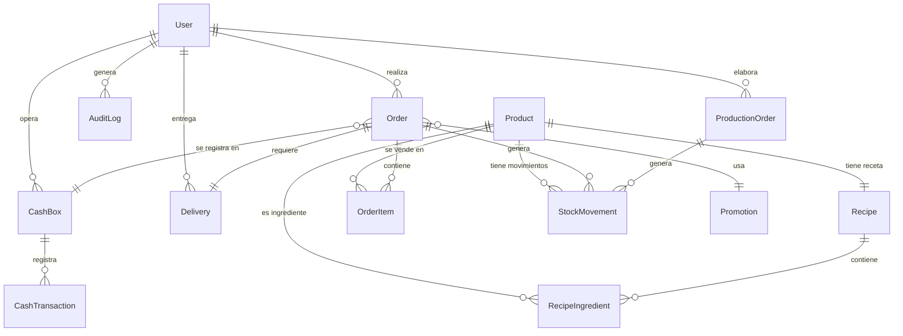

# 🔗 RELACIONES CLAVE DEL SCHEMA - DELICIAS JURÁSICAS

## 📊 Diagrama de Relaciones Principales



---

## 🎯 RELACIÓN CRÍTICA #1: Recetas (BOM)

### Estructura
```
Product (Pastel T-Rex)
  └── Recipe (Receta del Pastel)
      ├── RecipeIngredient (Harina: 500g)
      ├── RecipeIngredient (Huevos: 4 unidades)
      └── RecipeIngredient (Azúcar: 300g)
```

### Código de Ejemplo
```typescript
// Crear receta para "Pastel T-Rex"
const pastelTRex = await prisma.product.create({
  data: {
    sku: "PASTEL-TREX",
    name: "Pastel T-Rex",
    type: "PRODUCTO_TERMINADO",
    salePrice: 450,
    costPrice: 180,
    measureUnit: "UN",
    recipe: {
      create: {
        name: "Receta Pastel T-Rex",
        yieldQuantity: 1,
        yieldUnit: "UN",
        preparationTime: 120,
        ingredients: {
          create: [
            {
              ingredientId: "uuid-harina",
              quantity: 0.5,
              unit: "KG"
            },
            {
              ingredientId: "uuid-huevos",
              quantity: 4,
              unit: "UN"
            },
            {
              ingredientId: "uuid-azucar",
              quantity: 0.3,
              unit: "KG"
            }
          ]
        }
      }
    }
  }
});
```

### Query para obtener receta completa
```typescript
const receta = await prisma.recipe.findUnique({
  where: { productId: "uuid-pastel-trex" },
  include: {
    product: true,
    ingredients: {
      include: {
        ingredient: true  // Trae los datos completos del insumo
      }
    }
  }
});

// Resultado:
{
  id: "uuid-receta",
  name: "Receta Pastel T-Rex",
  ingredients: [
    {
      quantity: 0.5,
      unit: "KG",
      ingredient: {
        name: "Harina",
        currentStock: 25,
        costPrice: 20
      }
    },
    // ...
  ]
}
```

### Validaciones Importantes
```typescript
// ❌ PROHIBIDO: Usar un producto terminado como ingrediente
const invalidRecipe = await prisma.recipe.create({
  data: {
    ingredients: {
      create: {
        ingredientId: "uuid-pastel-chocolate",  // ❌ Es tipo PRODUCTO_TERMINADO
        quantity: 1
      }
    }
  }
});

// ✅ CORRECTO: Solo insumos como ingredientes
const validRecipe = await prisma.recipe.create({
  data: {
    ingredients: {
      create: {
        ingredientId: "uuid-harina",  // ✅ Es tipo INSUMO
        quantity: 0.5
      }
    }
  }
});
```

---

## 🎯 RELACIÓN CRÍTICA #2: Auditoría Inmutable

### Características
- **Tabla append-only**: Solo se insertan registros, nunca se modifican ni eliminan
- **JSON para flexibilidad**: `previousData` y `newData` almacenan el estado completo
- **Índices optimizados**: Por usuario, tabla y timestamp

### Implementación del Interceptor
```typescript
@Injectable()
export class AuditInterceptor implements NestInterceptor {
  constructor(private prisma: PrismaService) {}
  
  intercept(context: ExecutionContext, next: CallHandler): Observable<any> {
    const request = context.switchToHttp().getRequest();
    const { user, method, body, params } = request;
    const controllerName = context.getClass().name;
    
    // Capturar estado anterior para UPDATE/DELETE
    let previousData = null;
    
    return next.handle().pipe(
      tap(async (result) => {
        // Registrar en audit log
        await this.prisma.auditLog.create({
          data: {
            userId: user.id,
            action: method,
            tableName: this.extractTableName(controllerName),
            recordId: params.id || result?.id,
            previousData: previousData,
            newData: body,
            ipAddress: request.ip,
            userAgent: request.get('user-agent'),
            timestamp: new Date()
          }
        });
      })
    );
  }
}
```

### Ejemplo de Registro
```json
{
  "id": "uuid-audit",
  "userId": "uuid-user-admin",
  "action": "UPDATE",
  "tableName": "products",
  "recordId": "uuid-pastel-trex",
  "previousData": {
    "salePrice": 400,
    "isActive": true
  },
  "newData": {
    "salePrice": 450,
    "isActive": true
  },
  "ipAddress": "192.168.1.100",
  "timestamp": "2025-11-23T15:30:00Z"
}
```

### Consultas Útiles
```typescript
// Historial de cambios de un producto
const history = await prisma.auditLog.findMany({
  where: {
    tableName: 'products',
    recordId: productId
  },
  orderBy: { timestamp: 'desc' },
  include: { user: true }
});

// Actividad de un usuario
const userActivity = await prisma.auditLog.findMany({
  where: { userId },
  orderBy: { timestamp: 'desc' },
  take: 50
});

// Acciones en un rango de fechas
const dailyAudit = await prisma.auditLog.findMany({
  where: {
    timestamp: {
      gte: new Date('2025-11-23T00:00:00Z'),
      lte: new Date('2025-11-23T23:59:59Z')
    }
  }
});
```

---

## 🎯 RELACIÓN CRÍTICA #3: Movimientos de Stock

### Tipos de Movimientos

| Tipo | Afecta Stock | Casos de Uso |
|------|--------------|--------------|
| `COMPRA` | ➕ Positivo | Compra a proveedor |
| `PRODUCCION_ENTRADA` | ➕ Positivo | Producto terminado fabricado |
| `PRODUCCION_SALIDA` | ➖ Negativo | Insumos usados en fabricación |
| `VENTA` | ➖ Negativo | Venta a cliente |
| `AJUSTE_POSITIVO` | ➕ Positivo | Corrección al alza |
| `AJUSTE_NEGATIVO` | ➖ Negativo | Merma, robo, desperdicio |
| `DEVOLUCION` | ➕ Positivo | Cliente devuelve producto |

### Ejemplo de Flujo Completo
```typescript
// Escenario: Fabricar 10 pasteles T-Rex

// 1. Iniciar producción (descontar insumos)
await prisma.stockMovement.createMany({
  data: [
    {
      productId: "uuid-harina",
      type: "PRODUCCION_SALIDA",
      quantity: -5,        // 0.5kg x 10 unidades
      previousStock: 25,
      newStock: 20,
      productionOrderId: "uuid-production-order"
    },
    {
      productId: "uuid-huevos",
      type: "PRODUCCION_SALIDA",
      quantity: -40,       // 4 unidades x 10
      previousStock: 100,
      newStock: 60,
      productionOrderId: "uuid-production-order"
    }
  ]
});

// 2. Completar producción (incrementar producto terminado)
await prisma.stockMovement.create({
  data: {
    productId: "uuid-pastel-trex",
    type: "PRODUCCION_ENTRADA",
    quantity: 10,
    previousStock: 5,
    newStock: 15,
    productionOrderId: "uuid-production-order"
  }
});

// 3. Venta de 3 pasteles
await prisma.stockMovement.create({
  data: {
    productId: "uuid-pastel-trex",
    type: "VENTA",
    quantity: -3,
    previousStock: 15,
    newStock: 12,
    orderId: "uuid-order"
  }
});
```

### Reportes de Movimientos
```typescript
// Movimientos de un producto en un período
const movements = await prisma.stockMovement.findMany({
  where: {
    productId,
    createdAt: {
      gte: startDate,
      lte: endDate
    }
  },
  include: {
    product: true,
    order: true,
    productionOrder: true
  },
  orderBy: { createdAt: 'desc' }
});

// Calcular mermas (ajustes negativos)
const waste = await prisma.stockMovement.groupBy({
  by: ['productId'],
  where: {
    type: 'AJUSTE_NEGATIVO',
    createdAt: { gte: startDate, lte: endDate }
  },
  _sum: { quantity: true }
});
```

---

## 🎯 RELACIÓN CRÍTICA #4: Control de Caja

### Estructura
```
CashBox (Caja del día)
  ├── User (Cajero responsable)
  ├── Order[] (Ventas de la caja)
  └── CashTransaction[] (Movimientos de efectivo)
```

### Flujo de Arqueo
```typescript
// 1. Abrir caja
const cashBox = await prisma.cashBox.create({
  data: {
    boxNumber: "Caja 1",
    userId: "uuid-cajero",
    status: "OPEN",
    openingAmount: 500,  // Fondo inicial
    openedAt: new Date()
  }
});

// 2. Registrar ventas POS
const order = await prisma.order.create({
  data: {
    type: "POS",
    cashBoxId: cashBox.id,
    total: 450,
    // ...
  }
});

// 3. Registrar gastos
await prisma.cashTransaction.create({
  data: {
    cashBoxId: cashBox.id,
    type: "EXPENSE",
    amount: -200,
    description: "Pago a proveedor de harina",
    reference: "FACT-001"
  }
});

// 4. Cerrar caja (arqueo)
const sales = await prisma.order.aggregate({
  where: { cashBoxId: cashBox.id },
  _sum: { total: true }
});

const transactions = await prisma.cashTransaction.aggregate({
  where: { cashBoxId: cashBox.id },
  _sum: { amount: true }
});

const expectedAmount = 
  cashBox.openingAmount + 
  sales._sum.total + 
  transactions._sum.amount;

const actualAmount = 1650;  // Conteo físico
const difference = actualAmount - expectedAmount;

await prisma.cashBox.update({
  where: { id: cashBox.id },
  data: {
    status: "CLOSED",
    expectedAmount,
    actualAmount,
    difference,  // Faltante o sobrante
    closedAt: new Date()
  }
});
```

---

## 🎯 RELACIÓN CRÍTICA #5: Promociones

### Tipos de Descuentos

#### 1. Descuento por Porcentaje
```typescript
const promotion = await prisma.promotion.create({
  data: {
    code: "DINO20",
    name: "20% de descuento",
    type: "PERCENTAGE",
    discountValue: 20,
    minPurchase: 300,
    maxDiscount: 100,
    startDate: new Date('2025-11-01'),
    endDate: new Date('2025-11-30')
  }
});

// Aplicar: $500 * 20% = $100 descuento
```

#### 2. Cupón de Monto Fijo
```typescript
const promotion = await prisma.promotion.create({
  data: {
    code: "TREX50",
    type: "FIXED_AMOUNT",
    discountValue: 50,
    minPurchase: 200,
    usageLimit: 100
  }
});
```

#### 3. 2x1 (Buy X Get Y)
```typescript
const promotion = await prisma.promotion.create({
  data: {
    code: "2X1PASTELES",
    type: "BUY_X_GET_Y",
    buyQuantity: 2,
    getQuantity: 1
  }
});

// Lógica: Por cada 2 pasteles comprados, 1 gratis
```

---

## 📋 Índices y Performance

### Índices Definidos
```prisma
// Products
@@index([type])
@@index([isActive])

// Orders
@@index([customerId])
@@index([status])
@@index([type])
@@index([createdAt])

// AuditLog
@@index([userId])
@@index([tableName])
@@index([timestamp])

// StockMovement
@@index([productId])
@@index([type])
@@index([createdAt])
```

### Queries Optimizadas
```typescript
// ✅ BUENO: Usa índice
const activeProducts = await prisma.product.findMany({
  where: { isActive: true, type: 'PRODUCTO_TERMINADO' }
});

// ❌ MALO: Full table scan
const products = await prisma.product.findMany({
  where: { name: { contains: 'Pastel' } }  // No hay índice en name
});

// ✅ SOLUCIÓN: Full-text search con índice
// Agregar en schema:
// @@index([name], type: Gin)
```

---

## 🔒 Constraints y Validaciones

### Unicidad Compuesta
```prisma
model RecipeIngredient {
  @@unique([recipeId, ingredientId])
  // Evita duplicar el mismo ingrediente en una receta
}

model CartItem {
  @@unique([cartId, productId])
  // Un producto solo puede aparecer una vez por carrito
}
```

### Validaciones en Aplicación
```typescript
// Validar que una receta no tenga productos terminados
const invalidIngredients = await prisma.product.count({
  where: {
    id: { in: ingredientIds },
    type: { not: 'INSUMO' }
  }
});

if (invalidIngredients > 0) {
  throw new BadRequestException('Ingredientes inválidos');
}
```

---

## 🎯 Resumen de Mejores Prácticas

### 1. **Transacciones para Integridad**
```typescript
// Siempre usar transacciones para operaciones múltiples
await prisma.$transaction([
  prisma.product.update(...),
  prisma.stockMovement.create(...)
]);
```

### 2. **Soft Deletes**
```typescript
// NO eliminar físicamente, usar isActive
await prisma.product.update({
  where: { id },
  data: { isActive: false }
});
```

### 3. **Timestamps Automáticos**
```prisma
createdAt DateTime @default(now())
updatedAt DateTime @updatedAt
```

### 4. **Datos Desnormalizados para Performance**
```prisma
model Order {
  customerName  String  // Guardado aunque exista en User
  customerEmail String  // Por si el usuario se elimina
}
```

### 5. **Cascadas Cuidadosas**
```prisma
// Cascada en datos dependientes
order Order @relation(onDelete: Cascade)

// SetNull en referencias opcionales
customer User? @relation(onDelete: SetNull)
```
